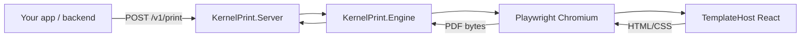

# KernelPrint MVP

KernelPrint is a small **print rendering platform** for teams that want to stop generating PDFs client-side with `jsPDF` + `html2canvas` and instead render **real HTML/CSS** using **headless Chromium** (Playwright) from a .NET service.

## What you get today

- **.NET library + service**
  - `KernelPrint.Engine`: Playwright rendering pipeline + browser pooling/recycling
  - `KernelPrint.Server`: `POST /v1/print` + health endpoints + basic metrics/logs
  - `KernelPrint.Contracts`: request/response DTOs
- **Template app (React/Vite)**
  - `templates/kernelprint-templates/invoice-app`: a polished invoice UI with a browser print button (for visual parity checks)
- **Docker Compose**
  - `docker-compose.yml`: runs templates + API together

## Why this replaces `jsPDF` well

- Pagination is handled by the browser print engine (Chromium), not manual canvas slicing.
- Layout fidelity is closer to “Print to PDF” from Chrome/Edge.
- You keep your SPA UX, but move PDF generation to a dedicated renderer.

## Architecture (high level)



## Quick Start with Docker

### 1) Build and run

```bash
docker compose up --build
```

### 2) Open services

- Template app (browser preview + print button): `http://localhost:4173`
- Print API: `http://localhost:5294`

### 3) Generate a PDF from the API

```bash
curl -X POST "http://localhost:5294/v1/print" \
  -H "Content-Type: application/json" \
  -H "X-Api-Key: change-me" \
  -d '{
    "templateUrl": "http://templates:4173",
    "data": {
      "invoiceNumber": "INV-2026-0415",
      "customer": "ACME Corp"
    },
    "options": {
      "format": "A4",
      "landscape": false
    }
  }' --output invoice.pdf
```

> If you call the API from your host machine (not from inside Docker), use:
> `templateUrl: "http://host.docker.internal:4173"`

### Security defaults

- Set `KernelPrint__Security__ApiKey` (recommended) and send it as `X-Api-Key`.
- Template URLs must be allowlisted via `KernelPrint__Engine__Templates__AllowedHosts`.
- By default, `data:` template URLs are blocked (`KernelPrint__Engine__Templates__BlockDataUrls`).
- Subresource loading can be restricted (`KernelPrint__Engine__Templates__EnforceResourceHostAllowlist`).

### Docker environment variables (common)

- `KERNELPRINT_API_KEY`: overrides the default API key used by compose (`change-me` is only a bootstrap default; change it).

## Local Development (without Docker)

- `dotnet build KernelPrint.slnx`
- `dotnet run --project src/KernelPrint.Server/KernelPrint.Server.csproj`
- `cd templates/kernelprint-templates/invoice-app && npm install && npm run dev`

### Playwright browser install (one-time per machine)

After restoring packages, install Chromium for Playwright (Windows example):

```powershell
powershell -ExecutionPolicy Bypass -File "samples/KernelPrint.Samples/bin/Debug/net10.0/playwright.ps1" install chromium
```

## API

### `POST /v1/print`

Body: `PrintRequest` (`KernelPrint.Contracts`)

- `templateUrl` **or** `templateId`
  - `templateId` is resolved against `KernelPrint:Engine:TemplateBaseUrl`
- `data`: JSON injected into the template page as `window.__KERNELPRINT_DATA__` and a `kernelprint:data-ready` event
- `options`: PDF + wait options (`PrintOptions`)

Headers:

- `X-Api-Key`: required when `KernelPrint:Security:ApiKey` is set (Docker compose enables this by default)
- `X-Correlation-Id`: optional; if omitted the server generates one and returns it on the response

Response:

- `application/pdf` bytes
- helpful headers like `X-KernelPrint-TotalMs` / `X-KernelPrint-RenderMs`

### Health

- `GET /health/live`
- `GET /health/ready`

## Template contract (important for reliability)

Templates should:

- Listen for `kernelprint:data-ready` (or read `window.__KERNELPRINT_DATA__` on boot)
- When rendering is complete, set:

```js
window.__KERNELPRINT_READY__ = true
```

Optionally, callers can also set:

- `options.waitFor.readySelector`
- `options.waitFor.readyExpression`

## Migrating from `jsPDF` in a React SPA (recommended pattern)

- Keep your modal UX in the product app.
- Add a dedicated **print template route** (even if your app is “no routes”, you can still use query flags like `?print=invoice`).
- Replace the `jsPDF` button with:

1. `fetch(POST /v1/print)` using `templateUrl` + `data`
2. download the returned PDF blob

## Configuration reference

See `src/KernelPrint.Server/appsettings.json` for defaults and tuning knobs under:

- `KernelPrint:Engine`
- `KernelPrint:Security`

## Troubleshooting

- **401 Unauthorized**: missing/wrong `X-Api-Key`.
- **Template blocked**: host not allowlisted; update `KernelPrint:Engine:Templates:AllowedHosts`.
- **Fonts blocked**: add hosts to `KernelPrint:Engine:Templates:ExtraResourceAllowedHosts` or disable allowlisting (not recommended publicly).
- **Colors missing in browser print preview**: enable “Background graphics” in the print dialog; templates also set `print-color-adjust: exact` where applicable.
